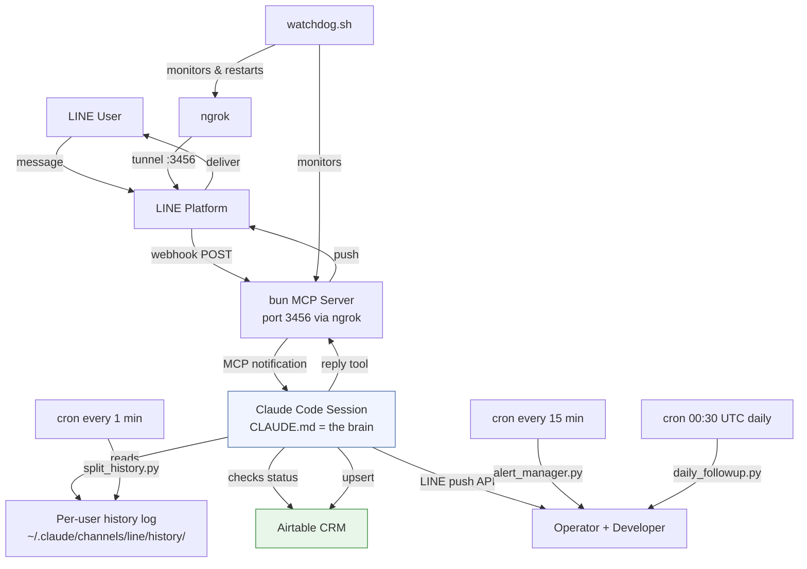
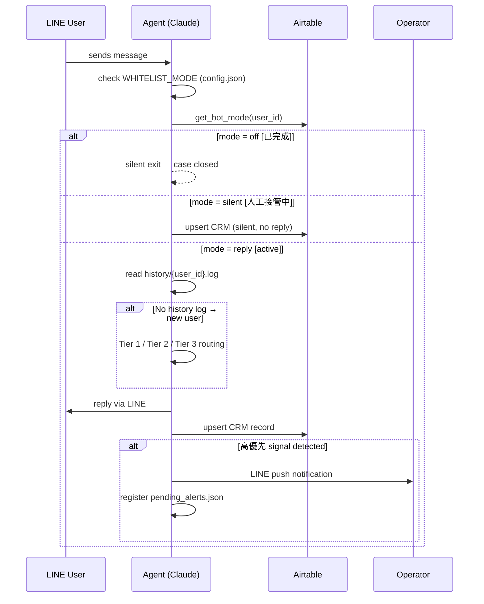
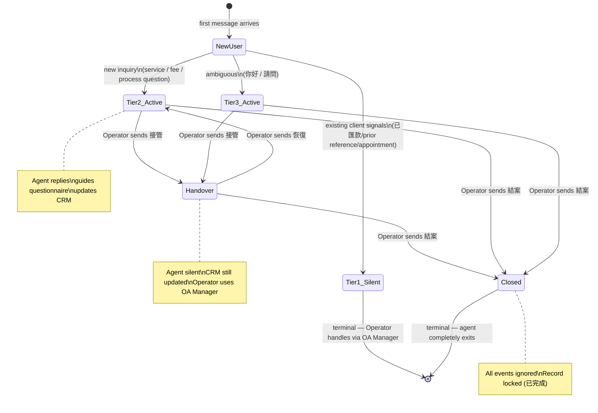
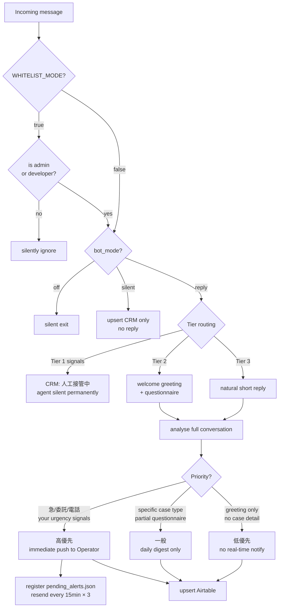

<div align="right">

🌐 **English** | [繁體中文](README.zh-TW.md)

</div>

# 全謹代書 LINE Agent

A 24/7 AI-powered client intake and CRM automation system for professional services businesses, built on **Claude Code + LINE Messaging API**.

The agent acts as a professional consultant, screens incoming clients, guides them through a service questionnaire, auto-logs everything to Airtable CRM, and escalates urgent cases to the team in real time — so staff only focus on high-value cases.

---

## Features

- **Zero-leakage intake** — every message from every user creates a CRM record, even silent ones
- **Intelligent tier routing** — auto-detects existing clients (silent), new clients (full welcome), and ambiguous messages (natural response)
- **Conversational questionnaire** — asks 1–2 questions per turn across 5 service areas
- **Real-time escalation** — pushes urgent cases (intent/urgency/contact signals) to the operator instantly via LINE DM
- **Persistent alerts** — unacknowledged high-priority cases are re-sent every 15 minutes (max 3×)
- **Human handover protocol** — operator sends `接管 {姓名}` to silence the agent; `恢復` to resume
- **Daily digest** — stale cases summarized every morning at 09:00 (configure timezone in cron)
- **Emergency kill switch** — `緊急關閉` instantly re-enables whitelist mode

---

## Architecture



---

## Message Handling Flow



---

## Agent State Machine



---

## CRM Priority Logic



---

## Repository Structure

```
line-bot/
├── README.md                      # This file (English)
├── README.zh-TW.md                # 繁體中文版本
├── CLAUDE.md                      # Agent behavior spec — persona, routing, CRM rules
├── SYSTEM_OVERVIEW.md             # Operator quick-reference (English)
├── SYSTEM_OVERVIEW.zh-TW.md      # 操作員快速參考（繁體中文）
├── config.example.json            # Config template — copy to ~/.claude/channels/line/config.json
├── launch.sh                      # Start Claude session (auto-restart + JSONL trimming)
├── start.sh                       # Start LINE webhook MCP server (bun)
├── watchdog.sh                    # Process guardian — keeps ngrok + bun alive
├── .mcp.json                      # MCP plugin wiring (bun ↔ Claude)
├── .claude/
│   └── settings.local.json        # Claude Code auto-allow permissions
└── lib/                           # Runtime Python modules
    ├── airtable_crm.py            # Core CRM: upsert, status, admin commands, cache
    ├── alert_manager.py           # Persistent alert resend (15 min, max 3×)
    ├── config_loader.py           # Reads config.json — shared by all Python modules
    ├── split_history.py           # Fan-out shared history.log → per-user logs
    ├── daily_followup.py          # Daily stale-case digest to operator
    ├── sla_checker.py             # SLA breach detector (4 hr threshold)
    ├── test_scenarios.py          # Unit + E2E tests (53 unit / 6 E2E)
    ├── business_guide.json        # Service areas, questionnaires, pricing template
    └── .env.example               # Credentials template
```

**Runtime deployment paths:**

| Repo path | Deploy to |
|-----------|-----------|
| `CLAUDE.md`, `*.sh`, `.mcp.json`, `.claude/` | `~/line-bot/` (as-is) |
| `lib/*.py`, `lib/*.json` | `~/.claude/channels/line/` |
| `lib/.env.example` → `.env` | `~/.claude/channels/line/.env` |
| `config.example.json` → `config.json` | `~/.claude/channels/line/config.json` |

---

## Prerequisites

| Dependency | Notes |
|-----------|-------|
| [Claude Code CLI](https://claude.ai/code) | `claude` binary in PATH |
| [Bun](https://bun.sh) | `~/.bun/bin/bun` (used by MCP server) |
| [LINE Developers](https://developers.line.biz) | Messaging API channel with webhook enabled |
| [Airtable](https://airtable.com) | Base + API token (see field schema below) |
| [ngrok](https://ngrok.com) | Exposes local port 3456 to LINE webhook |
| tmux | Session management for agent + watchdog |
| Python 3.10+ | For CRM scripts |

---

## Setup

### 1. Clone

```bash
git clone https://github.com/your-org/line-bot.git
cd line-bot
```

### 2. Configure credentials

```bash
mkdir -p ~/.claude/channels/line
cp lib/.env.example ~/.claude/channels/line/.env
# Edit .env — fill in all four values
```

### 3. Deploy runtime library

```bash
cp lib/*.py lib/*.json ~/.claude/channels/line/
```

### 4. Create config.json

```bash
cp config.example.json ~/.claude/channels/line/config.json
```

Open `~/.claude/channels/line/config.json` and fill in your values:

```json
{
  "WHITELIST_MODE": true,
  "EXISTING_CLIENT_DETECTION": true,
  "office_name": "Your Firm Name",
  "roles": {
    "developer": "YOUR_DEVELOPER_LINE_USER_ID",
    "admin": "YOUR_ADMIN_LINE_USER_ID"
  }
}
```

To find a LINE user ID: the agent receives it in every webhook event. Check `history.log` after your first message.

### 5. Set up Airtable

Create a table named `客戶紀錄` with these fields:

| Field name | Field type |
|-----------|-----------|
| `LINE用戶ID` | Single line text |
| `姓名` | Single line text |
| `性別` | Single select (男 / 女 / 未知) |
| `電話` | Phone number |
| `案件類型` | Single select — add your service area names + 其他 |
| `需求摘要` | Long text |
| `客戶類型` | Single select (急需解決 / 主動諮詢 / 資訊收集 / 觀望中) |
| `優先級` | Single select (高優先 / 一般 / 低優先) |
| `優先級判斷原因` | Long text |
| `進度狀態` | Single select (跟進中 / 進行中 / 暫停 / 人工接管中 / 已完成) |
| `待辦事項` | Long text |
| `對話摘要` | Long text |
| `客戶場景描述` | Long text |
| `問卷回答摘要` | Long text |
| `首次進線時間` | Date (include time, UTC) |
| `最後互動時間` | Date (include time, UTC) |

### 6. Install MCP plugin

The LINE channel MCP plugin must be installed in Claude Code:

```bash
claude mcp add claude-line-channel
```

Verify `.mcp.json` points to the installed plugin path (bun runtime path may differ per system).

### 7. Install cron jobs

```bash
crontab -e
```

Add:

```cron
# Split shared history into per-user logs every minute
* * * * * python3 ~/.claude/channels/line/split_history.py >> ~/.claude/channels/line/history/.split.log 2>&1

# Resend unacknowledged high-priority alerts every 15 minutes
*/15 * * * * python3 ~/.claude/channels/line/alert_manager.py >> ~/.claude/channels/line/alert.log 2>&1

# Daily stale-case digest at 09:00 local time (adjust UTC offset for your timezone)
30 1 * * * python3 ~/.claude/channels/line/daily_followup.py >> ~/.claude/channels/line/followup.log 2>&1
```

### 8. Launch

```bash
# Start process guardian (ngrok + bun watchdog) in background
tmux new-session -d -s watchdog "bash watchdog.sh"

# Start the agent in its own tmux session
tmux new-session -s line-bot "bash launch.sh"
```

### 9. Go live

1. In LINE Developers console, set webhook URL to your ngrok URL + `/webhook`
2. Enable webhook, disable auto-reply
3. Test by messaging the OA from your LINE account
4. When ready to open to the public: edit `~/.claude/channels/line/config.json`, set `"WHITELIST_MODE": false`

---

## Operator Commands (send via LINE DM to the bot)

| Command | Effect |
|---------|--------|
| `查 {姓名}` | Look up Airtable record and return summary |
| `接管 {姓名}` | Agent goes silent; client notified that a team member will follow up |
| `接管` | Same, auto-targets the most recent high-priority alert |
| `恢復 {姓名}` | Bot resumes auto-replies for this client |
| `結案 {姓名}` | Mark case complete; agent exits permanently for this client |
| `緊急關閉` | Immediately set `WHITELIST_MODE=true` in config.json and apply it |
| `已處理` / `已看到` / `收到` | Clear all pending alert resends |

**Important:** Always send `接管` before replying via OA Manager — otherwise both the agent and the human operator reply to the client simultaneously.

---

## Configuration Flags (in `~/.claude/channels/line/config.json`)

| Flag | Default | Effect |
|------|---------|--------|
| `WHITELIST_MODE: true` | Enabled | Only `developer` and `admin` get responses (soft launch mode) |
| `WHITELIST_MODE: false` | — | All users accepted (production mode) |
| `EXISTING_CLIENT_DETECTION: true` | Enabled | Tier 1 routing active — existing client signals trigger silent CRM |
| `EXISTING_CLIENT_DETECTION: false` | — | Everyone treated as new client (Tier 2/3 only) |

Edit `config.json` to change flags — or send `緊急關閉` for the emergency whitelist toggle.

---

## How Claude Code drives this

This system uses **Claude Code** (the CLI) as the agent runtime — not a traditional web server with hardcoded logic.

The `CLAUDE.md` file acts as a persistent behavior specification that Claude reads at the start of every session. The LINE MCP plugin delivers webhook events as conversational notifications. Claude processes each event, decides how to respond, runs CRM pipelines via `Bash` tool calls, and replies via the `mcp__line__reply` tool.

Key design decisions:

- **Behavior = plain language** — updating the bot's logic means editing `CLAUDE.md`, not deploying code
- **Python modules = I/O only** — `airtable_crm.py`, `alert_manager.py`, etc. handle external API calls; all decision logic stays in Claude
- **Per-user context via files** — `split_history.py` fans out the shared log; Claude reads `history/{user_id}.log` before every reply to reconstruct conversation context
- **5-minute Airtable cache** — `crm_cache.json` reduces API calls; cache is invalidated on every write

---

## Running Tests

```bash
cd ~/.claude/channels/line
python3 test_scenarios.py
```

Expected output: 53 unit tests + 6 E2E scenario tests, all passing.

---

## License

MIT

---

Made with love by **全謹代書團隊** 🙏
