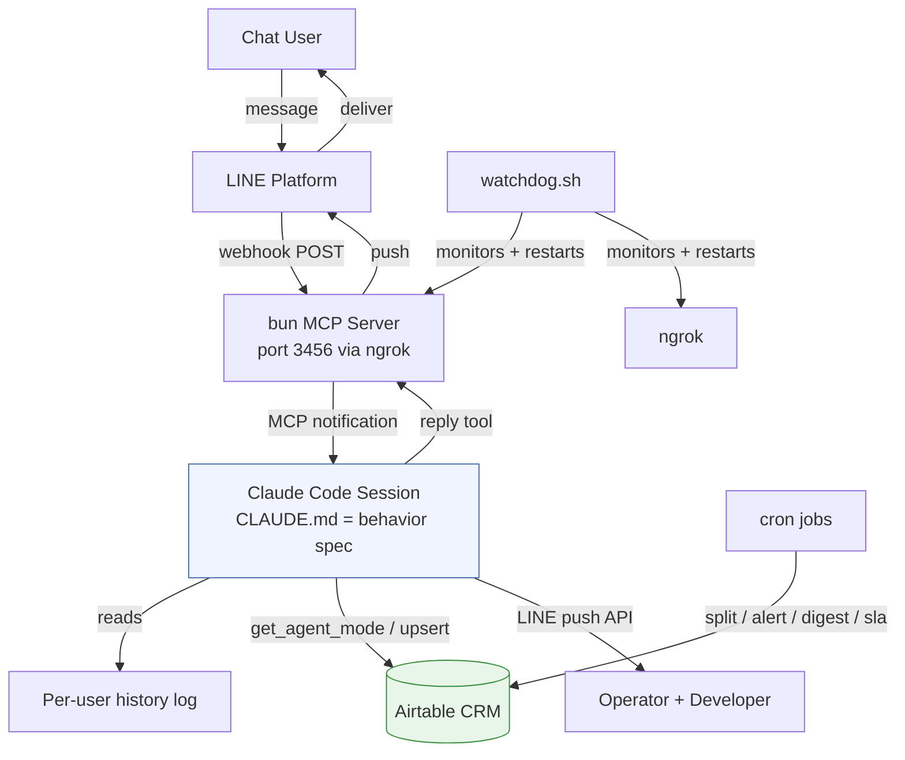
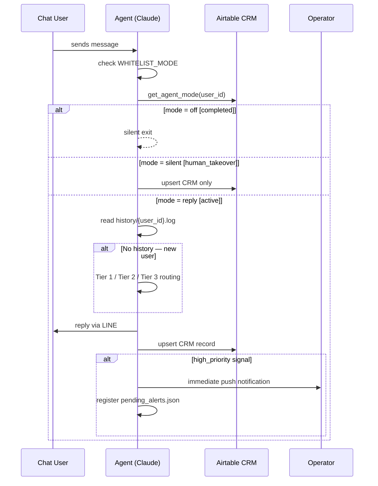

<div align="right">

🌐 **English** | [繁體中文](README.zh-TW.md)

</div>

# ServiceFlow-Agent

[](LICENSE)
[](https://python.org)
[](https://claude.ai/code)

**An autonomous Claude Code–powered messaging intake and CRM orchestration framework for professional services.**

ServiceFlow-Agent connects a chat channel (LINE implemented; WhatsApp/Telegram extensible) to an LLM agent that screens incoming clients, guides them through a conversational service questionnaire, auto-logs everything to Airtable CRM, escalates urgent cases to your team in real time, and supports human operator takeover — all configurable via a plain-language `CLAUDE.md` with no code deployment required.

Built for: law firms, consulting firms, accounting firms, clinics, agencies, customer support teams, and any appointment-based professional service intake workflow.

---

## Features

- **Zero-leakage intake** — every message creates a CRM record, including silent cases
- **Intelligent tier routing** — auto-detects existing clients (silent handover), new clients (full welcome + questionnaire), and ambiguous messages (natural response)
- **Conversational questionnaire** — asks 1–2 questions per turn; never dumps a form at the user
- **Real-time escalation** — pushes urgent cases (intent / urgency / phone / domain signals) to the operator instantly via LINE DM
- **Persistent alerts** — unacknowledged high-priority cases re-sent every 15 minutes (up to 3×)
- **Human handover protocol** — `takeover {name}` silences the agent; `resume {name}` restores it
- **SLA monitoring** — alerts the operator if any open case exceeds the response threshold
- **Daily digest** — stale cases summarized every morning at 09:00 (configurable cron)
- **Emergency kill switch** — `emergency_close` instantly re-enables whitelist mode
- **Behavior = plain language** — all logic lives in `CLAUDE.md`; no redeployment for behavior changes

---

## Architecture



---

## Message Flow



---

## Repository Structure

```
ServiceFlow-Agent/
├── CLAUDE.md                    # Agent behavior spec — persona, routing, CRM rules
├── README.md
├── README.zh-TW.md
├── LICENSE
├── CONTRIBUTING.md
├── requirements.txt
├── .env.example
├── .gitignore
├── config/
│   ├── config.example.json      # Runtime config template
│   └── crm_schema.example.json  # Airtable field schema reference
├── adapters/
│   ├── channel/
│   │   ├── README.md            # How to add a channel adapter
│   │   └── line/
│   │       ├── launch.sh        # Start Claude session (auto-restart + context trimming)
│   │       ├── start.sh         # Start LINE webhook MCP server (bun)
│   │       ├── watchdog.sh      # Process guardian — keeps ngrok + bun alive
│   │       └── .mcp.json        # MCP plugin wiring
│   ├── crm/
│   │   ├── README.md            # How to add a CRM adapter
│   │   └── airtable/
│   │       └── airtable_crm.py  # Airtable CRM adapter
│   └── llm/
│       └── README.md            # LLM runtime notes
├── src/
│   ├── config_loader.py         # Runtime config reader (shared by all modules)
│   ├── escalation/
│   │   ├── alert_manager.py     # Persistent alert resend (15 min × 3)
│   │   └── sla_checker.py       # SLA breach detector
│   ├── history/
│   │   └── split_history.py     # Fan-out shared log → per-user logs
│   ├── scheduler/
│   │   └── daily_followup.py    # Daily stale-case digest
│   └── test_scenarios.py        # Unit tests — customize for your service areas
├── examples/
│   ├── business_guide.example.json
│   ├── sample_configs/
│   │   ├── law_firm.json
│   │   ├── clinic.json
│   │   └── consulting.json
│   └── sample_conversations/
│       └── README.md
└── docs/
    ├── architecture.md
    ├── compliance.md
    ├── setup.md
    └── diagrams/
        ├── system_overview.md
        ├── message_flow.md
        ├── state_machine.md
        ├── escalation_pipeline.md
        └── deployment_topology.md
```

---

## Prerequisites

| Dependency | Notes |
|-----------|-------|
| [Claude Code CLI](https://claude.ai/code) | `claude` binary in PATH |
| [Bun](https://bun.sh) | `~/.bun/bin/bun` (used by LINE MCP server) |
| [LINE Developers account](https://developers.line.biz) | Messaging API channel with webhook enabled |
| [Airtable account](https://airtable.com) | Base + API token |
| [ngrok](https://ngrok.com) | Exposes local port 3456 to LINE webhook |
| tmux | Session management for agent + watchdog |
| Python 3.10+ | For CRM and scheduler scripts (stdlib only — no pip install) |

---

## Quick Start

```bash
# 1. Clone
git clone https://github.com/your-org/ServiceFlow-Agent.git
cd ServiceFlow-Agent

# 2. Configure credentials
mkdir -p ~/.claude/channels/line
cp .env.example ~/.claude/channels/line/.env
# Edit .env with your LINE + Airtable credentials

# 3. Deploy runtime library
cp adapters/crm/airtable/airtable_crm.py src/config_loader.py \
   src/escalation/alert_manager.py src/escalation/sla_checker.py \
   src/history/split_history.py src/scheduler/daily_followup.py \
   ~/.claude/channels/line/

# 4. Configure the agent
cp config/config.example.json ~/.claude/channels/line/config.json
# Edit config.json — set firm_name, team_name, roles
cp examples/business_guide.example.json ~/.claude/channels/line/business_guide.json
# Edit business_guide.json — add your real service areas and questionnaires

# 5. Edit CLAUDE.md — replace {{YOUR_FIRM_NAME}} and {{YOUR_TEAM_NAME}},
#    and add your domain-specific urgency signals

# 6. Install MCP plugin
claude mcp add claude-line-channel

# 7. Set up cron jobs (see docs/setup.md)
crontab -e

# 8. Launch
tmux new-session -d -s watchdog "bash adapters/channel/line/watchdog.sh"
tmux new-session -s line-agent "bash adapters/channel/line/launch.sh"
```

Full setup guide: [docs/setup.md](docs/setup.md)

---

## Configuration Flags

Edit `~/.claude/channels/line/config.json`:

| Flag | Default | Effect |
|------|---------|--------|
| `WHITELIST_MODE: true` | On | Only `developer` and `admin` get responses (soft launch) |
| `WHITELIST_MODE: false` | — | All users accepted (production) |
| `EXISTING_CLIENT_DETECTION: true` | On | Returning-client signals trigger Tier 1 silent CRM |
| `EXISTING_CLIENT_DETECTION: false` | — | Everyone treated as a new client |

---

## Airtable Field Schema

Create a table named `client_records` (or set `TABLE_NAME` in `.env`):

| Field | Type |
|-------|------|
| `channel_user_id` | Single line text — primary key |
| `name` | Single line text |
| `gender` | Single select: male / female / unknown |
| `phone` | Phone number |
| `case_type` | Single select — add your service area names + `other` |
| `summary` | Long text |
| `client_type` | Single select: urgent / proactive / exploratory / watching |
| `priority` | Single select: high_priority / normal / low_priority |
| `priority_reason` | Long text |
| `status` | Single select: active / in_progress / paused / human_takeover / completed |
| `action_items` | Long text |
| `conversation_summary` | Long text |
| `client_scenario` | Long text |
| `questionnaire_summary` | Long text |
| `first_contact_at` | Date (with time, UTC) |
| `last_interaction_at` | Date (with time, UTC) |

Full schema: [config/crm_schema.example.json](config/crm_schema.example.json)

---

## Operator Commands

Send via LINE DM to the agent's official account:

| Command | Effect |
|---------|--------|
| `lookup {name}` | Look up Airtable record and return a summary |
| `takeover {name}` | Agent goes silent; client notified a team member will follow up |
| `takeover` | Same — auto-targets the most recent high-priority alert |
| `resume {name}` | Agent resumes auto-replies for this client |
| `close {name}` | Mark case complete; agent exits permanently for this client |
| `emergency_close` | Immediately set `WHITELIST_MODE=true` in config.json |
| `acknowledged` / `ack` / `ok` | Clear all pending alert resends |

**Always send `takeover` before replying via OA Manager** — otherwise both the agent and operator reply to the client simultaneously.

---

## Cron Setup

```cron
* * * * *    python3 ~/.claude/channels/line/split_history.py  >> ~/.claude/channels/line/history/.split.log 2>&1
*/15 * * * * python3 ~/.claude/channels/line/alert_manager.py  >> ~/.claude/channels/line/alert.log 2>&1
30 1 * * *   python3 ~/.claude/channels/line/daily_followup.py >> ~/.claude/channels/line/followup.log 2>&1
*/30 * * * * python3 ~/.claude/channels/line/sla_checker.py    >> ~/.claude/channels/line/sla.log 2>&1
```

---

## How Claude Code Drives This

ServiceFlow-Agent uses **Claude Code** (the CLI) as the agent runtime — not a web server with hardcoded logic. `CLAUDE.md` is a persistent behavior spec that Claude reads at session startup. The LINE MCP plugin delivers webhook events as conversational notifications; Claude processes each one, runs CRM pipelines via `Bash` tool calls, and replies via `mcp__line__reply`.

- **Behavior = plain language** — logic changes mean editing `CLAUDE.md`, not deploying code
- **Python modules = I/O only** — all decisions stay in Claude; modules only handle API calls
- **Per-user context via files** — `split_history.py` fans out the shared log; Claude reads `history/{user_id}.log` before every reply
- **5-minute Airtable cache** — `crm_cache.json` reduces API calls; invalidated on every write

---

## Extending

- **New channel** (WhatsApp, Telegram, Webchat): [adapters/channel/README.md](adapters/channel/README.md)
- **New CRM** (HubSpot, Sheets, Notion): [adapters/crm/README.md](adapters/crm/README.md)
- **New behavior** (persona, routing, urgency signals): edit `CLAUDE.md` — no code changes

---

## Running Tests

```bash
export SERVICEFLOW_DATA_DIR=~/.claude/channels/line
python3 src/test_scenarios.py
```

Customize `SERVICE_KWS` and `HP_PATTERNS` in `src/test_scenarios.py` to match your service areas.

---

## Documentation

| | |
|-|-|
| [docs/setup.md](docs/setup.md) | Full deployment guide |
| [docs/architecture.md](docs/architecture.md) | Component architecture |
| [docs/compliance.md](docs/compliance.md) | Privacy and legal notes |
| [docs/diagrams/](docs/diagrams/) | Mermaid diagrams |
| [CONTRIBUTING.md](CONTRIBUTING.md) | Contributor guide |

---

## License

MIT — see [LICENSE](LICENSE).

---

*Built with [Claude Code](https://claude.ai/code) · Contributions welcome*
