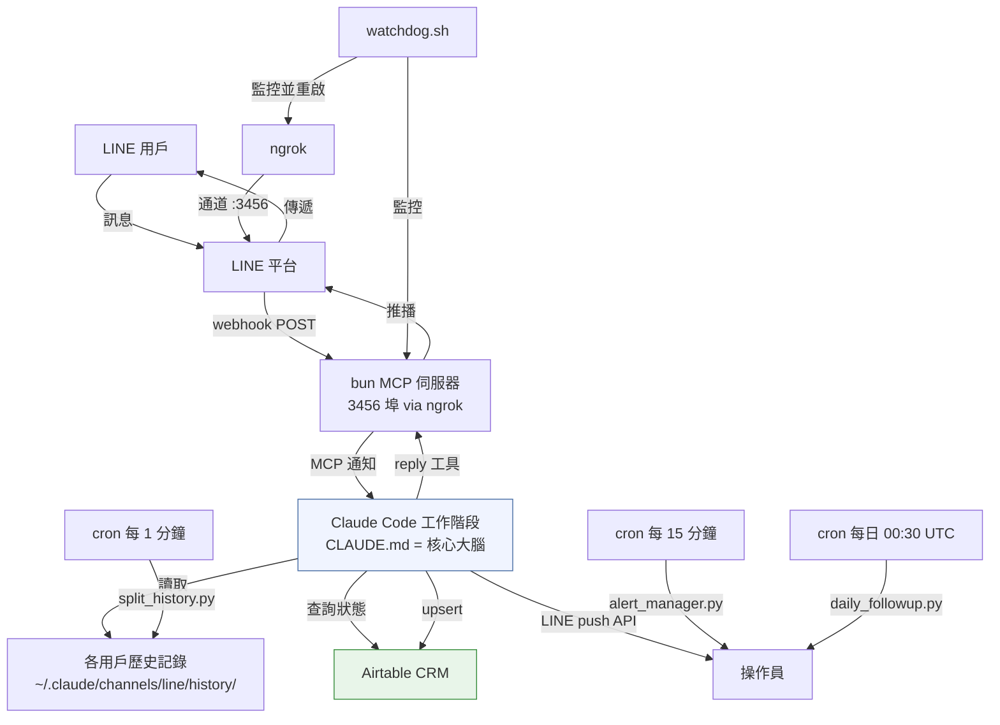
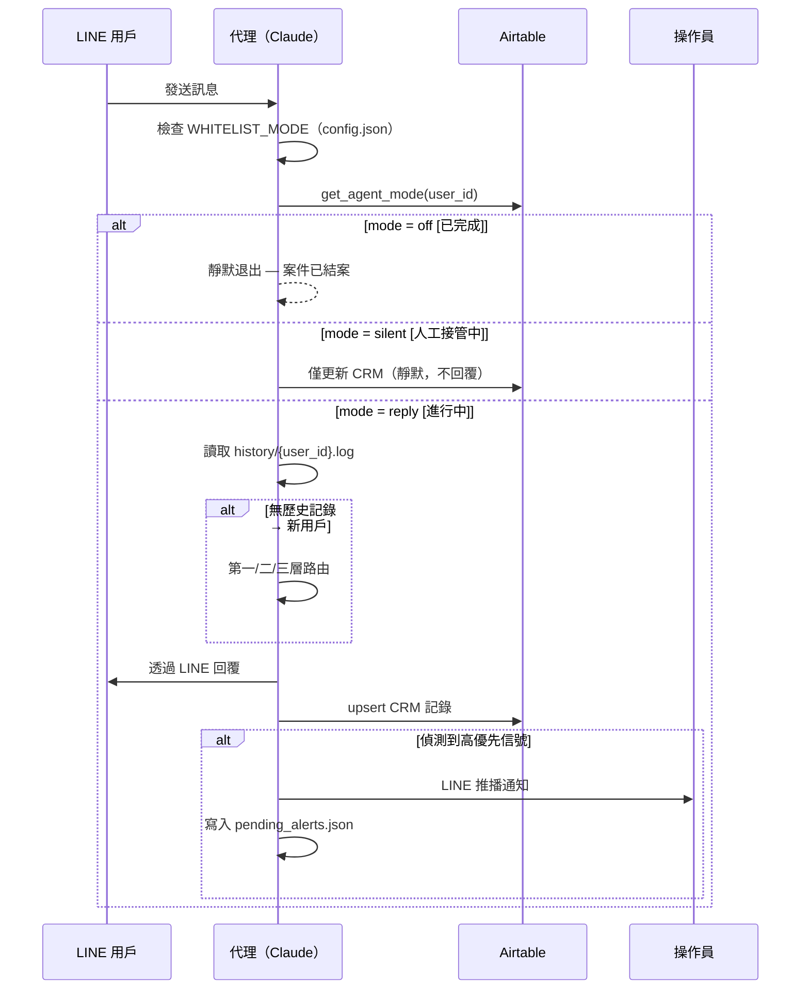
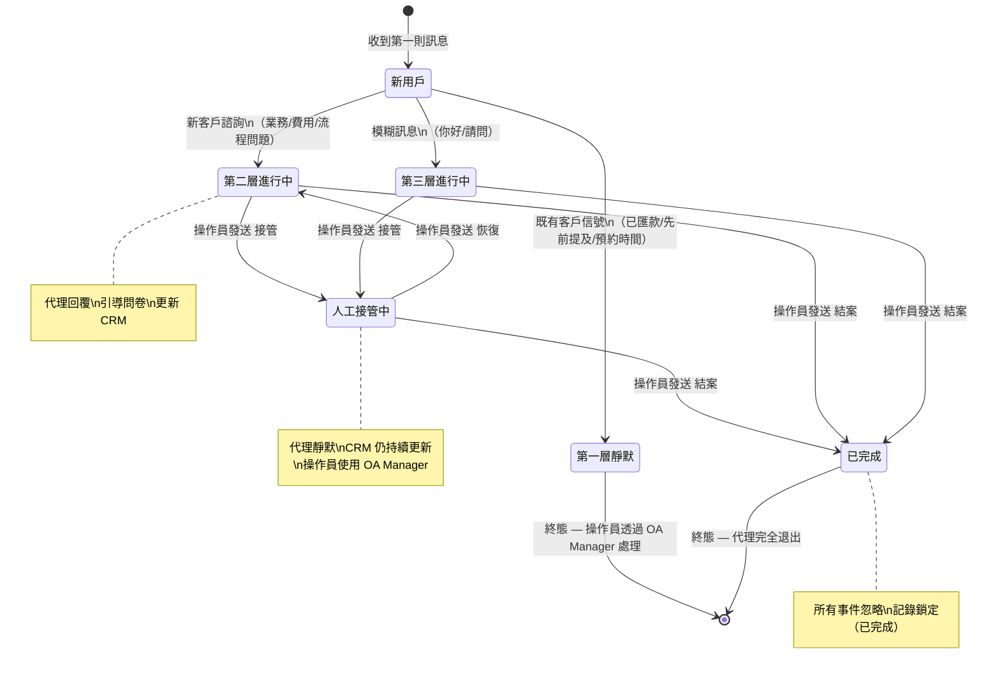
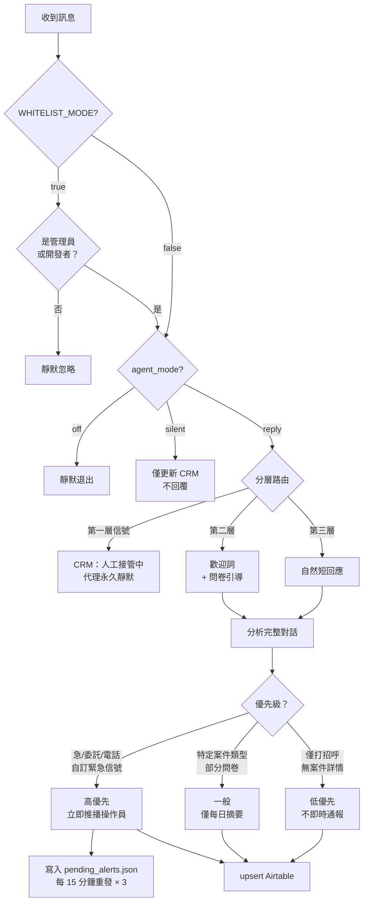

<div align="right">

🌐 [English](README.md) | **繁體中文**

</div>

# 全謹代書 LINE Agent

24/7 AI 驅動的代書客戶接待與 CRM 自動化系統，基於 **Claude Code + LINE Messaging API** 構建。

代理人扮演資深專業顧問角色，自動篩選進線客戶、引導問卷填寫、自動記錄至 Airtable CRM，並即時通報緊急案件至操作團隊——讓團隊只需專注於高價值案件。

---

## 功能特色

- **零遺漏接待** — 每則訊息都會建立 CRM 記錄，包含靜默回應的案件
- **智能分流路由** — 自動辨識既有客戶（靜默）、新客戶（完整歡迎）及模糊訊息（自然回應）
- **對話式問卷** — 每輪詢問 1–2 題，涵蓋 5 大業務領域
- **即時升級通報** — 緊急案件（委託/急/電話/自訂緊急信號）立即透過 LINE DM 通報操作員
- **持續警報機制** — 未確認的高優先案件每 15 分鐘重發一次（最多 3 次）
- **人工接管協議** — 操作員發送 `接管 {姓名}` 讓代理靜默；`恢復` 重新啟動
- **每日摘要** — 每天早上 09:00（依您的時區調整 cron）彙整逾期案件
- **緊急關閉開關** — `緊急關閉` 指令立即重啟白名單模式

---

## 系統架構



---

## 訊息處理流程



---

## 代理狀態機



---

## CRM 優先級邏輯



---

## 專案結構

```
line-agent/
├── README.md                      # 英文版本
├── README.zh-TW.md                # 本文件（繁體中文）
├── CLAUDE.md                      # 代理行為規格 — 角色、路由、CRM 規則
├── SYSTEM_OVERVIEW.md             # 操作員快速參考（英文）
├── SYSTEM_OVERVIEW.zh-TW.md      # 操作員快速參考（繁體中文）
├── config.example.json            # 設定範本 — 複製至 ~/.claude/channels/line/config.json
├── launch.sh                      # 啟動 Claude 工作階段（自動重啟 + JSONL 修剪）
├── start.sh                       # 啟動 LINE webhook MCP 伺服器（bun）
├── watchdog.sh                    # 程序守護 — 保持 ngrok + bun 存活
├── .mcp.json                      # MCP 插件設定（bun ↔ Claude）
├── .claude/
│   └── settings.local.json        # Claude Code 自動允許權限
└── lib/                           # 執行期 Python 模組
    ├── airtable_crm.py            # 核心 CRM：upsert、狀態、管理指令、快取
    ├── alert_manager.py           # 持續警報重發（15 分鐘，最多 3 次）
    ├── config_loader.py           # 讀取 config.json — 所有 Python 模組共用
    ├── split_history.py           # 共享 history.log 分拆為各用戶記錄
    ├── daily_followup.py          # 每日逾期案件摘要至操作員
    ├── sla_checker.py             # SLA 違規偵測（4 小時閾值）
    ├── test_scenarios.py          # 單元 + E2E 測試（53 個單元 / 6 個 E2E）
    ├── business_guide.json        # 業務領域、問卷、定價範本
    └── .env.example               # 憑證範本
```

**執行期部署路徑：**

| 專案路徑 | 部署至 |
|---------|-------|
| `CLAUDE.md`、`*.sh`、`.mcp.json`、`.claude/` | `~/line-agent/`（原樣） |
| `lib/*.py`、`lib/*.json` | `~/.claude/channels/line/` |
| `lib/.env.example` → `.env` | `~/.claude/channels/line/.env` |
| `config.example.json` → `config.json` | `~/.claude/channels/line/config.json` |

---

## 先決條件

| 依賴項目 | 說明 |
|---------|------|
| [Claude Code CLI](https://claude.ai/code) | `claude` 執行檔在 PATH 中 |
| [Bun](https://bun.sh) | `~/.bun/bin/bun`（MCP 伺服器使用） |
| [LINE Developers](https://developers.line.biz) | 已啟用 webhook 的 Messaging API 頻道 |
| [Airtable](https://airtable.com) | 資料庫 + API 令牌（欄位架構見下方） |
| [ngrok](https://ngrok.com) | 將本地 3456 埠暴露至 LINE webhook |
| tmux | 代理 + 守護程序的工作階段管理 |
| Python 3.10+ | CRM 腳本使用 |

---

## 設定步驟

### 1. 克隆專案

```bash
git clone https://github.com/RealChrisL/scrivener-agent.git
cd scrivener-agent
```

### 2. 設定憑證

```bash
mkdir -p ~/.claude/channels/line
cp lib/.env.example ~/.claude/channels/line/.env
# 編輯 .env — 填入所有四個值
```

### 3. 部署執行期函式庫

```bash
cp lib/*.py lib/*.json ~/.claude/channels/line/
```

### 4. 建立 config.json

```bash
cp config.example.json ~/.claude/channels/line/config.json
```

開啟 `~/.claude/channels/line/config.json` 並填入您的值：

```json
{
  "WHITELIST_MODE": true,
  "EXISTING_CLIENT_DETECTION": true,
  "office_name": "您的事務所名稱",
  "roles": {
    "developer": "YOUR_DEVELOPER_LINE_USER_ID",
    "admin": "YOUR_ADMIN_LINE_USER_ID"
  }
}
```

要找到 LINE 用戶 ID：代理在每個 webhook 事件中都會收到。在第一次發送訊息後查看 `history.log`。

### 5. 設定 Airtable

建立名為 `客戶紀錄` 的資料表，包含以下欄位：

| 欄位名稱 | 欄位類型 |
|---------|---------|
| `LINE用戶ID` | 單行文字 |
| `姓名` | 單行文字 |
| `性別` | 單選（男 / 女 / 未知） |
| `電話` | 電話號碼 |
| `案件類型` | 單選 — 填入您的服務類型名稱 + 其他 |
| `需求摘要` | 長文字 |
| `客戶類型` | 單選（急需解決 / 主動諮詢 / 資訊收集 / 觀望中） |
| `優先級` | 單選（高優先 / 一般 / 低優先） |
| `優先級判斷原因` | 長文字 |
| `進度狀態` | 單選（跟進中 / 進行中 / 暫停 / 人工接管中 / 已完成） |
| `待辦事項` | 長文字 |
| `對話摘要` | 長文字 |
| `客戶場景描述` | 長文字 |
| `問卷回答摘要` | 長文字 |
| `首次進線時間` | 日期（含時間，UTC） |
| `最後互動時間` | 日期（含時間，UTC） |

### 6. 安裝 MCP 插件

```bash
claude mcp add claude-line-channel
```

確認 `.mcp.json` 指向已安裝的插件路徑（bun 執行期路徑可能因系統而異）。

### 7. 安裝 cron 任務

```bash
crontab -e
```

添加：

```cron
# 每分鐘將共享記錄拆分為各用戶記錄
* * * * * python3 ~/.claude/channels/line/split_history.py >> ~/.claude/channels/line/history/.split.log 2>&1

# 每 15 分鐘重發未確認的高優先警報
*/15 * * * * python3 ~/.claude/channels/line/alert_manager.py >> ~/.claude/channels/line/alert.log 2>&1

# 每日 09:00 台灣時間（01:00 UTC）發送逾期案件摘要
30 1 * * * python3 ~/.claude/channels/line/daily_followup.py >> ~/.claude/channels/line/followup.log 2>&1
```

### 8. 啟動

```bash
# 在背景啟動程序守護（ngrok + bun 監控）
tmux new-session -d -s watchdog "bash watchdog.sh"

# 在獨立的 tmux 工作階段啟動代理
tmux new-session -s line-agent "bash launch.sh"
```

### 9. 正式上線

1. 在 LINE Developers 控制台，將 webhook URL 設為您的 ngrok URL + `/webhook`
2. 啟用 webhook，停用自動回覆
3. 從您的 LINE 帳號傳送訊息給官方帳號進行測試
4. 準備好向公眾開放時：編輯 `~/.claude/channels/line/config.json`，設定 `"WHITELIST_MODE": false`

---

## 操作員指令（透過 LINE DM 傳送給代理）

| 指令 | 效果 |
|------|------|
| `查 {姓名}` | 查詢 Airtable 記錄並回傳摘要 |
| `接管 {姓名}` | 代理靜默；通知客戶將由專人跟進 |
| `接管` | 同上，自動針對最近的高優先警報 |
| `恢復 {姓名}` | 代理恢復自動回覆 |
| `結案 {姓名}` | 標記案件完成；代理永久退出此客戶 |
| `緊急關閉` | 立即設定 config.json 中 `WHITELIST_MODE=true` 並即時生效 |
| `已處理` / `已看到` / `收到` | 清除所有待發警報重發 |

**重要：** 透過 OA Manager 回覆前務必先發送 `接管` — 否則代理和操作員將同時回覆客戶。

---

## 設定開關（在 `~/.claude/channels/line/config.json` 中）

| 開關 | 預設值 | 效果 |
|------|-------|------|
| `WHITELIST_MODE: true` | 啟用 | 只有 `developer` 和 `admin` 獲得回應（軟上線模式） |
| `WHITELIST_MODE: false` | — | 接受所有用戶（正式模式） |
| `EXISTING_CLIENT_DETECTION: true` | 啟用 | 第一層路由啟動 — 既有客戶信號觸發靜默 CRM |
| `EXISTING_CLIENT_DETECTION: false` | — | 所有人視為新客戶（僅第二/三層） |

編輯 `config.json` 來更改這些設定 — 或發送 `緊急關閉` 進行緊急白名單切換。

---

## Claude Code 如何驅動此系統

此系統使用 **Claude Code**（CLI）作為代理執行期 — 而非帶有硬編碼邏輯的傳統 Web 伺服器。

`CLAUDE.md` 文件作為 Claude 在每個工作階段開始時讀取的持久行為規格。LINE MCP 插件將 webhook 事件作為對話通知傳遞。Claude 處理每個事件，決定如何回應，透過 `Bash` 工具調用執行 CRM 管線，並透過 `mcp__line__reply` 工具回覆。

關鍵設計決策：

- **行為 = 純文字** — 更新代理邏輯意味著編輯 `CLAUDE.md`，無需部署代碼
- **Python 模組 = 僅 I/O** — `airtable_crm.py`、`alert_manager.py` 等處理外部 API 調用；所有決策邏輯保留在 Claude 中
- **透過文件的各用戶上下文** — `split_history.py` 分拆共享記錄；Claude 在每次回覆前讀取 `history/{user_id}.log` 以重建對話上下文
- **5 分鐘 Airtable 快取** — `crm_cache.json` 減少 API 調用；每次寫入時使快取失效

---

## 執行測試

```bash
cd ~/.claude/channels/line
python3 test_scenarios.py
```

預期輸出：53 個單元測試 + 6 個 E2E 情境測試，全部通過。

---

## 授權條款

MIT

---

Made with love by **全謹代書團隊** 🙏
