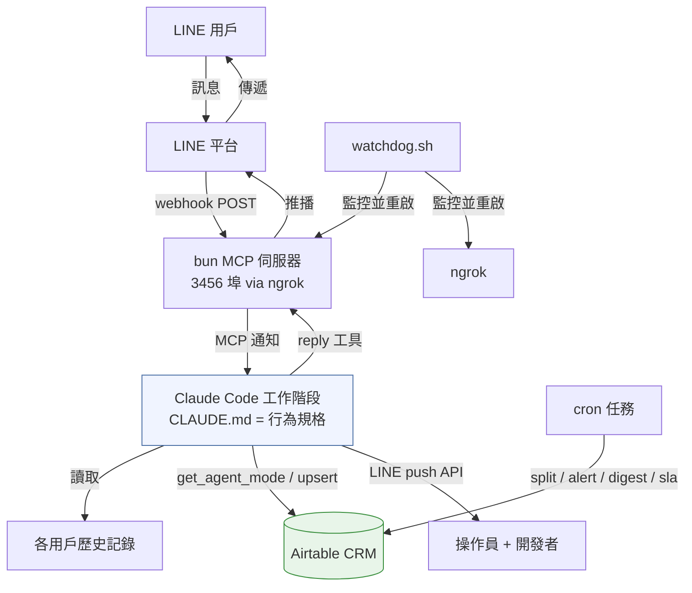
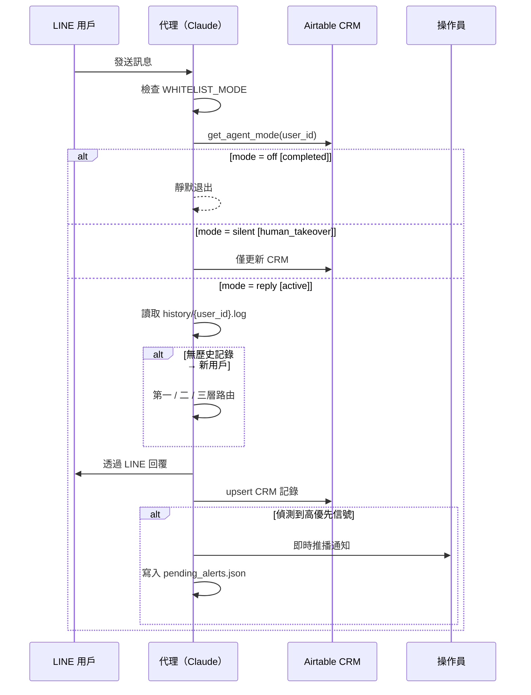

<div align="right">

🌐 [English](README.md) | **繁體中文**

</div>

# ServiceFlow-Agent

[](LICENSE)
[](https://python.org)
[](https://claude.ai/code)

**基於 Claude Code 的自主訊息接待與 CRM 編排框架，專為專業服務設計。**

ServiceFlow-Agent 將聊天頻道（已實作 LINE；可擴展至 WhatsApp / Telegram）連接至 LLM 代理，自動篩選進線客戶、引導對話式服務問卷、將所有資訊記錄至 Airtable CRM、即時通報緊急案件，並支援人工接管——全部透過一個純文字的 `CLAUDE.md` 設定，無需部署程式碼。

適用對象：法律事務所、顧問公司、會計師事務所、診所、代理商、客服團隊，以及所有需要預約制專業服務接待流程的業務。

---

## 功能特色

- **零遺漏接待** — 每則訊息都建立 CRM 記錄，包含靜默案件
- **智能分流路由** — 自動辨識既有客戶（靜默交接）、新客戶（完整歡迎 + 問卷）及模糊訊息（自然回應）
- **對話式問卷** — 每輪詢問 1–2 題，絕不一次傾倒表單
- **即時升級通報** — 緊急案件（委託意願 / 急迫性 / 電話號碼 / 自訂信號）立即透過 LINE DM 通報操作員
- **持續警報機制** — 未確認的高優先案件每 15 分鐘重發一次（最多 3 次）
- **人工接管協議** — `takeover {name}` 讓代理靜默；`resume {name}` 恢復
- **SLA 監控** — 若案件超過設定回應時限則通報操作員
- **每日摘要** — 每天早上 09:00 彙整逾期案件（可調整 cron）
- **緊急關閉開關** — `emergency_close` 立即重啟白名單模式
- **行為 = 純文字** — 所有邏輯存於 `CLAUDE.md`；修改行為不需部署程式碼

---

## 系統架構



---

## 訊息處理流程



---

## 專案結構

```
ServiceFlow-Agent/
├── CLAUDE.md                    # 代理行為規格 — 角色、路由、CRM 規則
├── README.md
├── README.zh-TW.md
├── LICENSE
├── CONTRIBUTING.md
├── requirements.txt
├── .env.example
├── .gitignore
├── config/
│   ├── config.example.json      # 執行期設定範本
│   └── crm_schema.example.json  # Airtable 欄位架構參考
├── adapters/
│   ├── channel/
│   │   ├── README.md            # 新增頻道適配器指南
│   │   └── line/
│   │       ├── launch.sh        # 啟動 Claude 工作階段
│   │       ├── start.sh         # 啟動 LINE webhook MCP 伺服器
│   │       ├── watchdog.sh      # 程序守護
│   │       └── .mcp.json        # MCP 插件設定
│   ├── crm/
│   │   ├── README.md            # 新增 CRM 適配器指南
│   │   └── airtable/
│   │       └── airtable_crm.py  # Airtable CRM 適配器
│   └── llm/
│       └── README.md            # LLM 執行期說明
├── src/
│   ├── config_loader.py         # 設定讀取器（所有模組共用）
│   ├── escalation/
│   │   ├── alert_manager.py     # 持續警報重發（15 分鐘 × 3）
│   │   └── sla_checker.py       # SLA 違規偵測
│   ├── history/
│   │   └── split_history.py     # 共享記錄分拆為各用戶記錄
│   ├── scheduler/
│   │   └── daily_followup.py    # 每日逾期案件摘要
│   └── test_scenarios.py        # 單元測試 — 依您的業務自訂
├── examples/
│   ├── business_guide.example.json
│   ├── sample_configs/
│   │   ├── law_firm.json
│   │   ├── clinic.json
│   │   └── consulting.json
│   └── sample_conversations/
│       └── README.md
└── docs/
    ├── architecture.md
    ├── compliance.md
    ├── setup.md
    └── diagrams/
        ├── system_overview.md
        ├── message_flow.md
        ├── state_machine.md
        ├── escalation_pipeline.md
        └── deployment_topology.md
```

---

## 先決條件

| 依賴項目 | 說明 |
|---------|------|
| [Claude Code CLI](https://claude.ai/code) | `claude` 執行檔在 PATH 中 |
| [Bun](https://bun.sh) | `~/.bun/bin/bun`（LINE MCP 伺服器使用） |
| [LINE Developers 帳號](https://developers.line.biz) | 已啟用 webhook 的 Messaging API 頻道 |
| [Airtable 帳號](https://airtable.com) | 資料庫 + API 令牌 |
| [ngrok](https://ngrok.com) | 將本地 3456 埠暴露至 LINE webhook |
| tmux | 代理 + 守護程序的工作階段管理 |
| Python 3.10+ | CRM 腳本使用（僅標準函式庫，無需 pip） |

---

## 快速開始

```bash
# 1. 克隆專案
git clone https://github.com/your-org/ServiceFlow-Agent.git
cd ServiceFlow-Agent

# 2. 設定憑證
mkdir -p ~/.claude/channels/line
cp .env.example ~/.claude/channels/line/.env
# 編輯 .env — 填入 LINE + Airtable 憑證

# 3. 部署執行期函式庫
cp adapters/crm/airtable/airtable_crm.py src/config_loader.py \
   src/escalation/alert_manager.py src/escalation/sla_checker.py \
   src/history/split_history.py src/scheduler/daily_followup.py \
   ~/.claude/channels/line/

# 4. 設定代理
cp config/config.example.json ~/.claude/channels/line/config.json
# 編輯 config.json — 填入 firm_name、team_name、roles
cp examples/business_guide.example.json ~/.claude/channels/line/business_guide.json
# 編輯 business_guide.json — 填入您的實際服務項目與問卷

# 5. 編輯 CLAUDE.md — 替換 {{YOUR_FIRM_NAME}}、{{YOUR_TEAM_NAME}}
#    並新增業務特定的緊急信號

# 6. 安裝 MCP 插件
claude mcp add claude-line-channel

# 7. 設定 cron 任務（詳見 docs/setup.md）
crontab -e

# 8. 啟動
tmux new-session -d -s watchdog "bash adapters/channel/line/watchdog.sh"
tmux new-session -s line-agent "bash adapters/channel/line/launch.sh"
```

完整設定指南：[docs/setup.md](docs/setup.md)

---

## 設定開關

編輯 `~/.claude/channels/line/config.json`：

| 開關 | 預設值 | 效果 |
|------|-------|------|
| `WHITELIST_MODE: true` | 啟用 | 只有 `developer` 和 `admin` 獲得回應（軟上線模式） |
| `WHITELIST_MODE: false` | — | 接受所有用戶（正式模式） |
| `EXISTING_CLIENT_DETECTION: true` | 啟用 | 既有客戶信號觸發第一層靜默 CRM |
| `EXISTING_CLIENT_DETECTION: false` | — | 所有人視為新客戶 |

---

## Airtable 欄位架構

建立名為 `client_records` 的資料表（或在 `.env` 設定 `TABLE_NAME`）：

| 欄位 | 類型 |
|------|------|
| `channel_user_id` | 單行文字 — 主要索引鍵 |
| `name` | 單行文字 |
| `gender` | 單選：male / female / unknown |
| `phone` | 電話號碼 |
| `case_type` | 單選 — 填入您的服務項目名稱 + `other` |
| `summary` | 長文字 |
| `client_type` | 單選：urgent / proactive / exploratory / watching |
| `priority` | 單選：high_priority / normal / low_priority |
| `priority_reason` | 長文字 |
| `status` | 單選：active / in_progress / paused / human_takeover / completed |
| `action_items` | 長文字 |
| `conversation_summary` | 長文字 |
| `client_scenario` | 長文字 |
| `questionnaire_summary` | 長文字 |
| `first_contact_at` | 日期（含時間，UTC） |
| `last_interaction_at` | 日期（含時間，UTC） |

完整架構：[config/crm_schema.example.json](config/crm_schema.example.json)

---

## 操作員指令

透過 LINE DM 傳送給代理的官方帳號：

| 指令 | 效果 |
|------|------|
| `lookup {name}` | 查詢 Airtable 記錄並回傳摘要 |
| `takeover {name}` | 代理靜默；通知客戶將由專人跟進 |
| `takeover` | 同上，自動針對最近的高優先案件 |
| `resume {name}` | 代理恢復自動回覆 |
| `close {name}` | 標記案件完成；代理永久退出此客戶 |
| `emergency_close` | 立即設定 `WHITELIST_MODE=true` |
| `acknowledged` / `ack` / `ok` | 清除所有待發警報 |

**透過 OA Manager 回覆前務必先發送 `takeover`** — 否則代理和操作員將同時回覆客戶。

---

## Cron 任務設定

```cron
* * * * *    python3 ~/.claude/channels/line/split_history.py  >> ~/.claude/channels/line/history/.split.log 2>&1
*/15 * * * * python3 ~/.claude/channels/line/alert_manager.py  >> ~/.claude/channels/line/alert.log 2>&1
30 1 * * *   python3 ~/.claude/channels/line/daily_followup.py >> ~/.claude/channels/line/followup.log 2>&1
*/30 * * * * python3 ~/.claude/channels/line/sla_checker.py    >> ~/.claude/channels/line/sla.log 2>&1
```

---

## Claude Code 如何驅動此系統

此系統使用 **Claude Code**（CLI）作為代理執行期——而非帶有硬編碼邏輯的傳統 Web 伺服器。`CLAUDE.md` 是 Claude 在每個工作階段開始時讀取的持久行為規格。

- **行為 = 純文字** — 更新代理邏輯意味著編輯 `CLAUDE.md`，無需部署程式碼
- **Python 模組 = 僅 I/O** — 所有決策保留在 Claude；模組僅處理外部 API 調用
- **透過文件的各用戶上下文** — `split_history.py` 分拆共享記錄；Claude 在每次回覆前讀取 `history/{user_id}.log`
- **5 分鐘 Airtable 快取** — `crm_cache.json` 減少 API 調用；每次寫入時使快取失效

---

## 擴展

- **新頻道**（WhatsApp、Telegram、網頁聊天）：[adapters/channel/README.md](adapters/channel/README.md)
- **新 CRM**（HubSpot、Sheets、Notion）：[adapters/crm/README.md](adapters/crm/README.md)
- **新行為**（角色、路由、緊急信號）：編輯 `CLAUDE.md` — 無需修改程式碼

---

## 執行測試

```bash
export SERVICEFLOW_DATA_DIR=~/.claude/channels/line
python3 src/test_scenarios.py
```

---

## 文件

| | |
|-|-|
| [docs/setup.md](docs/setup.md) | 完整部署指南 |
| [docs/architecture.md](docs/architecture.md) | 元件架構 |
| [docs/compliance.md](docs/compliance.md) | 隱私與法律注意事項 |
| [docs/diagrams/](docs/diagrams/) | Mermaid 架構圖 |
| [CONTRIBUTING.md](CONTRIBUTING.md) | 貢獻者指南 |

---

## 授權條款

MIT — 詳見 [LICENSE](LICENSE)。

---

*以 [Claude Code](https://claude.ai/code) 構建 · 歡迎貢獻*
