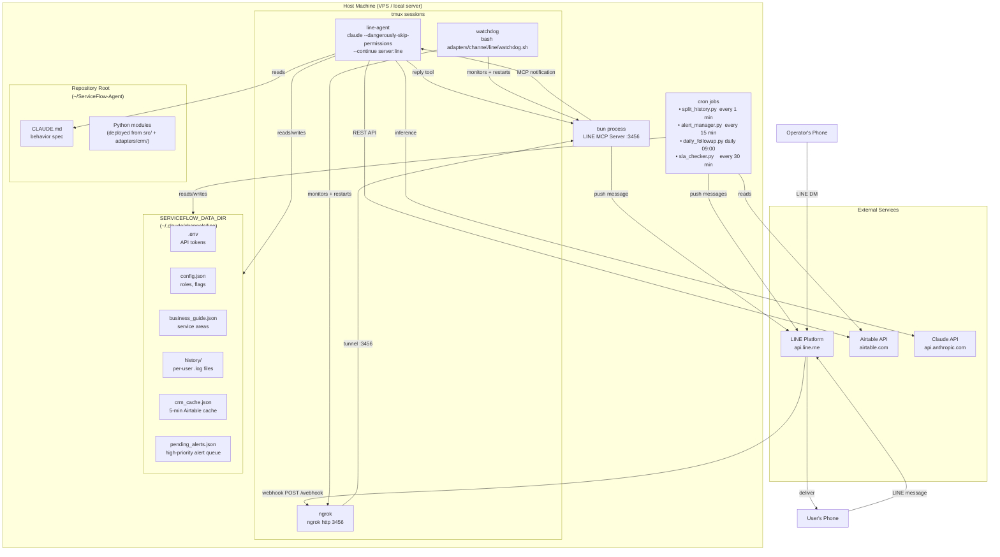

# Deployment Topology

Runtime environment for the ServiceFlow-Agent LINE adapter.

## Port and Network Summary

| Component | Port | Notes |
|-----------|------|-------|
| bun MCP Server | 3456 (default) | Local only; exposed via ngrok |
| ngrok tunnel | 4040 (admin API) | ngrok HTTPS URL registered as LINE webhook |
| Airtable API | 443 (HTTPS) | Outbound from host |
| LINE API | 443 (HTTPS) | Outbound from host |
| Claude API | 443 (HTTPS) | Outbound from host |

## Scaling Notes

- **Single-node by design.** The Claude Code session is stateful (uses `--continue`),
  so horizontal scaling requires session affinity or an external state store.
- **VPS recommendation.** A 2 vCPU / 2 GB RAM instance is sufficient for most
  professional services deployments (< 1000 clients).
- **Production hardening.** Replace ngrok with a proper reverse proxy (nginx + SSL cert)
  and set `LINE_WEBHOOK_PORT` to an internally-accessible port.
