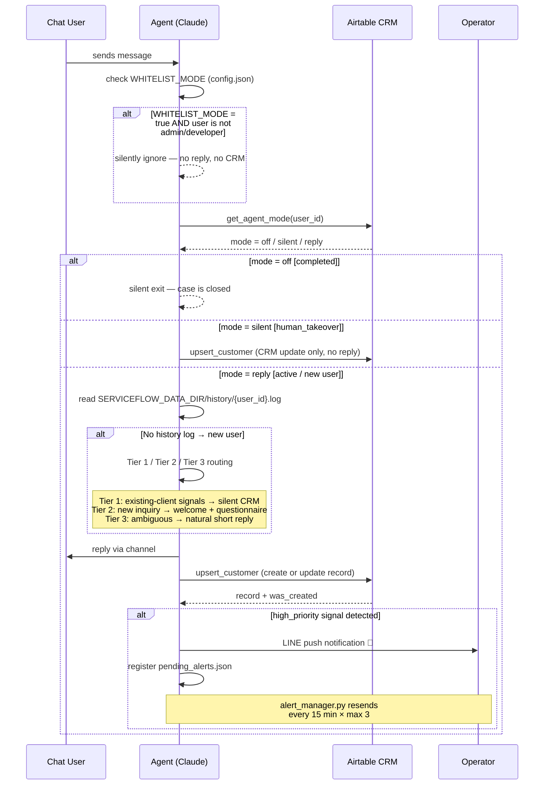

# Message Handling Flow

End-to-end sequence for a single incoming message.

## Notes

- **Whitelist check** runs before any CRM write — blocked users generate zero data.
- **agent_mode** is read from Airtable on every message; the 5-minute local cache
  (`crm_cache.json`) keeps latency low.
- **Tier 1** routing is only triggered on the *first* message from a user with no
  existing history log. Returning users always reach the `mode = reply` branch.
- **CRM upsert** runs even in `silent` mode (human_takeover) — the operator can
  always see the latest message in Airtable without the agent replying.
