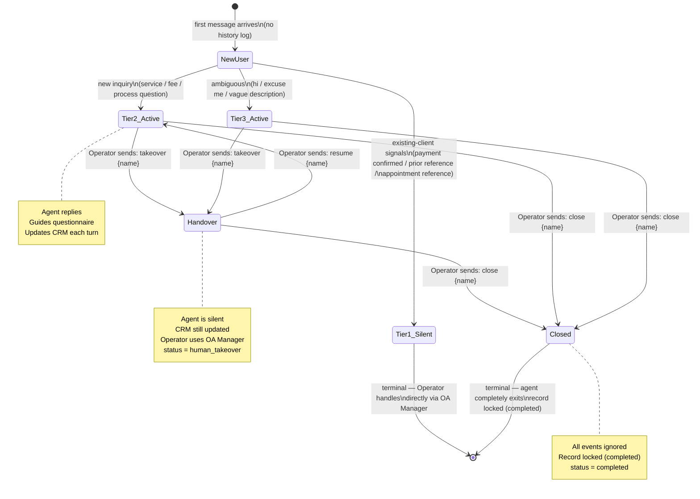

# Agent State Machine

State transitions for a single user's relationship with the agent.

## CRM Status Mapping

| State | `status` field | Agent replies? | CRM updated? |
|-------|----------------|----------------|--------------|
| NewUser / Tier2 / Tier3 (active) | `active` | ✅ | ✅ |
| In-progress case | `in_progress` | ✅ | ✅ |
| Temporarily paused | `paused` | ✅ | ✅ |
| Handover | `human_takeover` | ❌ | ✅ |
| Closed | `completed` | ❌ | ❌ |
| Tier 1 silent (new user) | `human_takeover` | ❌ | ✅ |

## Operator Transitions

Operators control two manual transitions:
- `takeover {name}` → sets status to `human_takeover` (agent goes silent)
- `close {name}` → sets status to `completed` (terminal)

All other transitions (`active`, `in_progress`, `paused`, `resume`) are
handled automatically by the agent based on conversation context.
